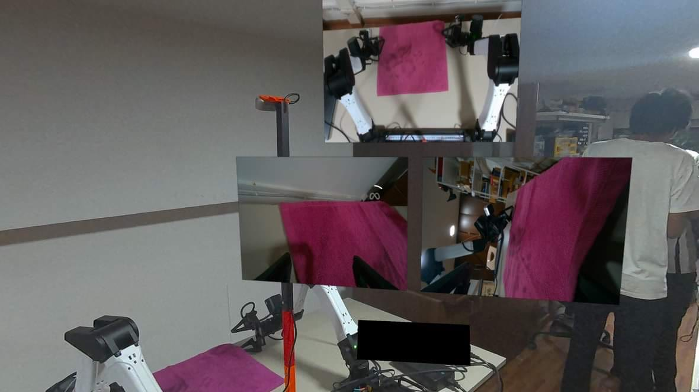

# Cameras

Karma captures RGB from two kinds of camera through one reader interface, so
teleop recording, inference, rollout and HITL do not care which is behind a
role:

| Backend | Identity | Capture | Typical use |
| --- | --- | --- | --- |
| `realsense` | serial number (`--camera-serial ROLE=SERIAL`) | RealSense SDK, 848×480 @ 30 fps default | YAM cell: D435 overhead, D405 wrists |
| `opencv` | device path (`--camera ROLE=/dev/videoN`) | `cv2.VideoCapture` over V4L2, MJPG | SO101 with ordinary USB webcams |

Roles are `top`, `left_wrist`, `right_wrist` and `side`; a policy server
receives them as `top_cam`, `left_cam`, `right_cam`, `side_cam`. Keep framing,
rotation, exposure and lighting consistent between demonstrations and
deployment — policy input is RGB, there is no image-space correction.

## RealSense

A RealSense is addressed by serial: `/dev/videoN` changes on replug, the serial
does not. Use USB 3 and rigid mounts. Discover devices:

```bash
uv run python -c 'import pyrealsense2 as rs; print([(d.get_info(rs.camera_info.name), d.get_info(rs.camera_info.serial_number)) for d in rs.context().query_devices()])'
```

Capture goes through the SDK rather than OpenCV because, measured on D405s,
OpenCV's V4L2 path tops out around 10–13 fps at 848×480 where the SDK holds 30
on three cameras at once. 848×480 is the D405's native colour mode; other sizes
make the firmware rescale and cost frame rate.

```bash
uv run karma cameras --rig yam_bimanual \
  --camera-serial top=TOP_SERIAL \
  --camera-serial left_wrist=LEFT_SERIAL \
  --camera-serial right_wrist=RIGHT_SERIAL --probe
```

The packaged YAM serials are placeholders for the original workstation; pass
your own. `--camera ROLE=/dev/videoN` on a RealSense role pins discovery to a
device path for diagnosis; the stream is still opened by serial.

## USB webcams (OpenCV)

A UVC webcam has no serial Karma can key on, so its identity is the device
path. On a role with no RealSense serial (every SO101 role by default),
`--camera ROLE=/dev/videoN` declares an OpenCV camera; leave `--camera-serial`
out for that role. Find the capture node of each camera — the `index0` node,
not the metadata node — and keep the cameras on the same USB ports:

```bash
ls -l /dev/v4l/by-path/
uv run karma cameras --rig so101 \
  --camera top=/dev/video5 --camera side=/dev/video7 --probe --snapshot /tmp/cams
```

The reader asks V4L2 for MJPG at the rig's size and rate, which is what lifts a
typical webcam from ~10 fps (raw YUYV over USB 2) to its advertised rate. The
webcam negotiates the nearest mode it offers — a 640×480 camera asked for
848×480 delivers 640×480 — and the probe reports what it settled on. Frames are
never rescaled: a policy trained on one framing should not silently get a
stretched version of another. Latest-frame-wins, one consumer per device, same
as the SDK reader.

`karma doctor --rig` does not take camera roles; `karma cameras` is the camera
preflight, and the policy commands run the same checks before energizing.

## Rigs and roles



Example Quest view with the workspace and multiple camera feeds visible together.
Use probe snapshots to verify the role and framing of each camera in your own setup.

- **YAM** declares `top`, `left_wrist`, `right_wrist`; the checkpoint expects all
  three in that order.
- **SO101** declares only `top`. Add `side` (the SO100/SO101 checkpoint's second
  fixed view) or the arm's wrist with `--camera-serial` or `--camera`. A
  single-arm rig accepts only its own wrist role.
- Plain teleop needs no cameras. Recording can use `--no-cameras` for
  state-only diagnostics; policy inference requires at least `top`.

`--probe` opens cameras one at a time, waits for the first frame, measures the
delivered rate over a window and, with `--snapshot DIR`, writes `ROLE.png`. A
declared policy camera that is missing fails startup. A missing YAM wrist must
not be substituted with the top image — that changes the checkpoint's
observation.

## Troubleshooting

- *Device or resource busy*: another process holds the camera (RealSense
  Viewer, a browser preview, a previous run still closing). A camera opens
  once; the relay and recorder share readers during collection/HITL.
- *Low measured fps on a webcam*: check `v4l2-ctl -d /dev/videoN
  --list-formats-ext` offers MJPG at that size; USB 2 hubs shared between two
  cameras halve the budget; dim scenes make auto-exposure drop the rate.
- *Wrong camera on a role*: the `by-path` symlinks tell you which physical port
  each node is on; snapshots tell you which is which.
- Optional rotation and capture size live in the rig's `RigCamera` definition.
  Camera extrinsics only affect visualization metadata.

## Local configuration

Packaged serials are synthetic placeholders. Keep local camera maps and
calibration under the ignored `calibration/` directory. The standalone relay
accepts `CAM_MAP=calibration/camera-map.json`, a JSON object mapping serials to
`top`, `left` or `right`.
